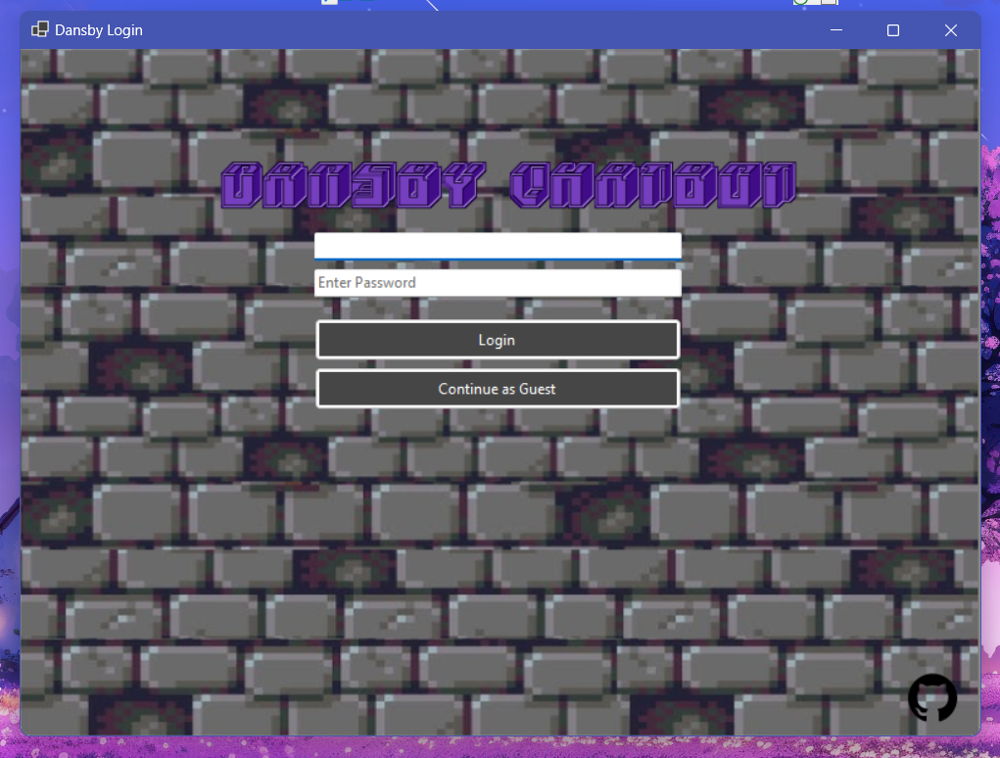
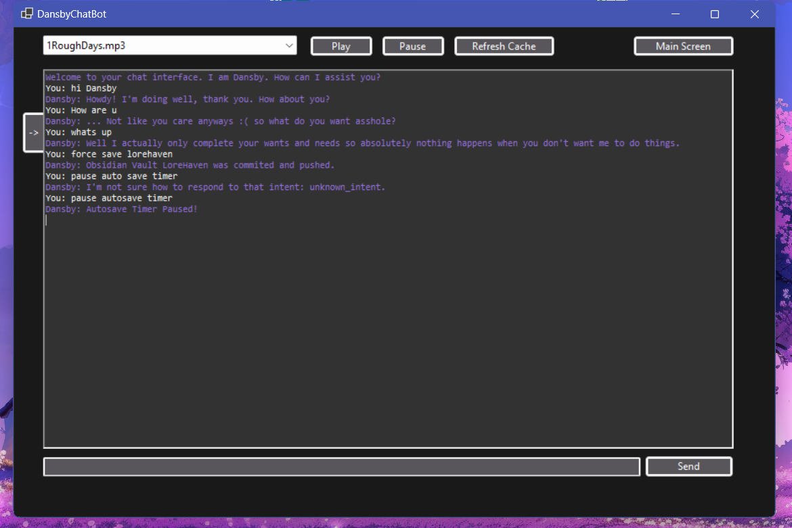
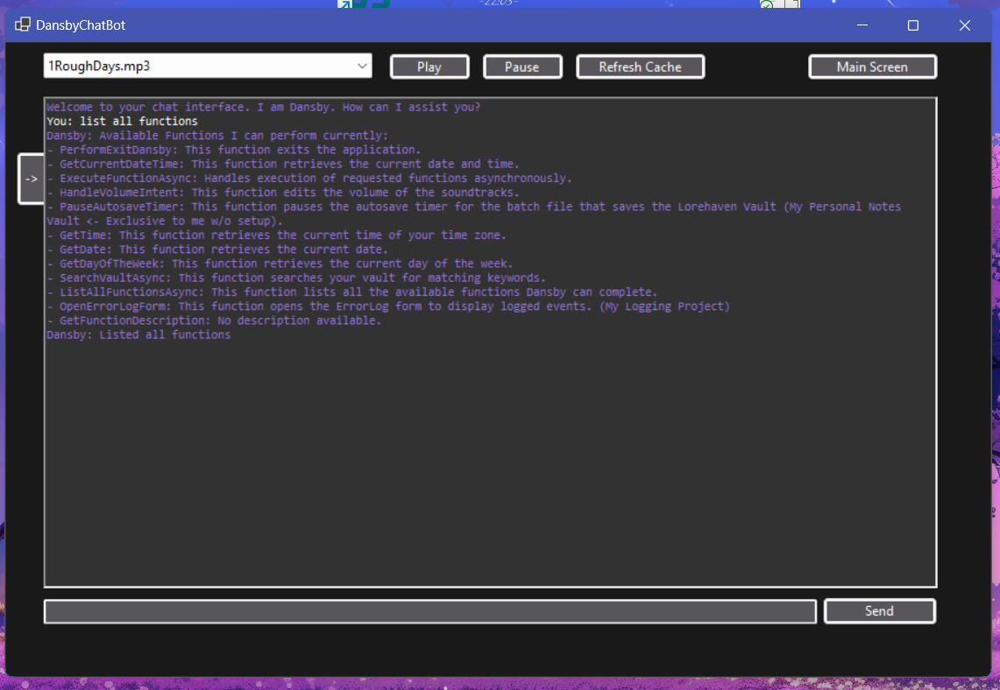

# Dansby ChatBot
-----------------------------------

> **Dansby Version: 1.1 (WIP)**

## **Table of Contents**
1. [Overview](#1-Overview)
2. [System Architecture](#2-system-architecture)
3. [Intent Recognition System](#3-intent-recognition-system)
4. [SoundTrack Management](#4-soundtrack-management)
5. [Response Generator](#5-response-generator)
6. [Action Intents (Functions.cs)](#6-action-intents-functionscs)
7. [Animation Manager](#7-animation-manager)
8. [Process Automation for Batch Files](#8-process-automation-for-batch-files)
9. [DevLog.md](#9-devlogmd)

--------------------------------------------------

## 1. Overview

- Dansby is a Chatbot/Assistant I am creating for the goal of many automated processes and for fun. This is my primary entry project that I plan to build continuously over time. The end goal is a real world application that can assist me in ways that mirror "Jarvis" from the Marvel "Iron Man" movies. The application can handle multiple functions such as intent recognition, process automation, logging, multimedia playback, etc... I've attempted to build it with extensibility in mind for the ever changing nature of the code base to allow easy integration down the line for systems like smart home control, web hosting, and data analysis. SideNote: This project is purely for my own use and fun and mainly assists in my journey to become a better programmer.



## 2. System Architecture

Dansby consists of several core components:

### 2.1 Core Modules 
- DansbyCore: Manages the main logic, including initializing and linking all subsystems.

- IntentRecognizer: Uses NLP-based intent recognition to process user commands.

- ResponseGenerator: Uses the intents and maps to json containing hard-coded responses (Only capable of small talk responses).

- Functions: Routes recognized intents to the appropriate functions (I reference these as actionIntents often).

- ErrorLogger: Handles logging for debugging and tracking system performance (Communicates with another project of mine ErrorLoggerHost).

- SoundtrackManager: Manages audio playback and volume control (DISCLAIMER: I do not own any rights to the media included in this project and will remove them for any issue).

### 2.2 Communication Protocols
- Dansby primarily uses TCP and can only log data when connected to my home IP address. This is due to the lack of hashing and encryption on the data and will eventually be phased out for better use of Websockets, MQTT, or protocols of similar nature. 

### 2.3 UI MainForm
- Dansby primarily uses WinForms as of Version 1.1 but I am thinking about migrating to electron or MAUI for crossplatform use. His MainForm.cs involves multiple UI components (ScreenShot Below).



------------------------------------------------

## 3. Intent Recognition System

Intents are stored in intent_mappings.json with the following structure:

```
[
    {
        "Name": "greeting",
        "Examples": [
            { "Utterance": "hello", "Tokens": ["hello"] },
            { "Utterance": "hi there", "Tokens": ["hi", "there"] }
        ],
        "Tags": ["greet", "casual"]
    }
]
```
### 3.2 Jaccard Similarity Matching
- The isMatch() function uses Jaccard similarity to determine how closely user input matches a stored intent. This allows for partial matches while maintaining accuracy. I tend to use a 50% accuracy ratio as of the time I am writing this documentation. 

-----------------------------------

## 4. SoundTrack Management

The SoundtrackManager handles audio playback and integrates with Dansby’s volume control system.

### 4.1 Features

- Plays MP3 files from a designated directory.

- Supports volume adjustments via user intents and a UI slider.

- Organizes music into playlists (folders) for categorized playback.

### 4.2 Volume Control Implementation

- Users can adjust volume via:

    - Text Commands (e.g., "Set volume to 50%")

    - Direct Function Calls in Function.cs

----------------------------------------------

## 5. Response Generator

The ResponseGenerator is responsible for generating responses based on user intents.

### 5.1 Features

- Maps recognized intents to predefined JSON-based responses.

- Supports static responses for small talk and general commands.

### 5.2 Implementation

- Responses are stored in responses.json with predefined mappings.

- Functions in ResponseGenerator.cs retrieve and return the appropriate response.

-------------------------------------------

## 6. Action Intents (Functions.cs)

The Functions.cs file routes recognized intents to their corresponding actions.

### 6.1 Features

- Handles system automation tasks, logging, and multimedia interactions.

- Contains various utility functions such as HandleVolumeIntent(), SearchVaultAsync(), and PerformExitDansby().

- Integrates with multiple modules such as SoundtrackManager, ErrorLogger, and IntentRecognizer.

- You can run the command "list all functions" and it will return you all capable functions (actionIntents) Dansby is currently capable in regards to the version.



-----------------------------------------------------

## 7. Animation Manager

The AnimationManager.cs controls UI-based animations for a more interactive user experience.

### 7.1 Features

- Manages transitions and effects within the WinForms UI.

- Future plans include integrating real-time 3D animations if migration to a new UI framework occurs.

---------------------------------------------------

## 8. Process Automation for Batch Files

Dansby supports automated execution of batch files for various system processes.

### 8.1 Features

- Executes scripts for version control (autosave.bat for Git commits).

- Automates repetitive tasks such as backing up data and syncing files.

- Plans to introduce a scheduling system for automated task execution.

------------------------------------------

## 9. DevLog.md

More information on DevLog.md -> This is a timeline of commits and notes I have written for self reflection as well as more insight into the project such as To-Do's, issues and difficulties faced, changes or plans, etc... 

### [View the DevLog](DevLog.md)

